# Vision-Language Navigation: Final Results Report

**Generated:** 2026-05-14 19:44
**Author:** Balveer Singh (balveer.25aiz0011@iitrpr.ac.in)

---

## Summary Dashboard
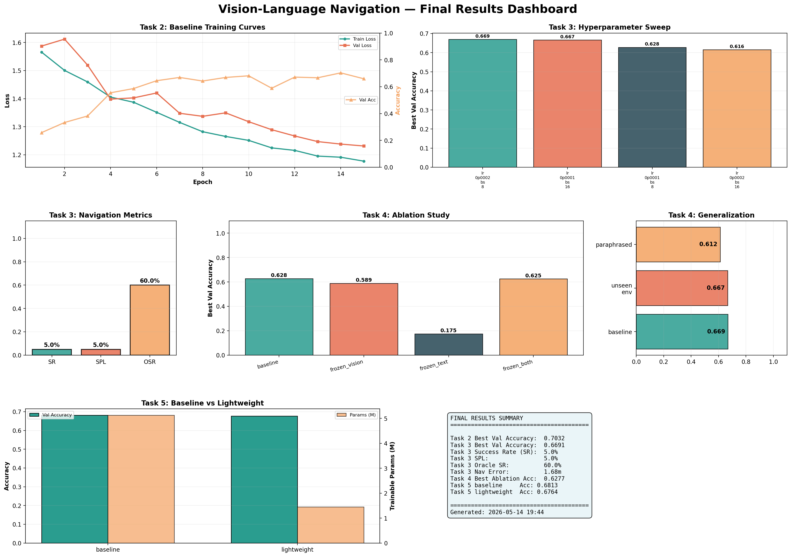

## Task 2: Vision-Language Model Implementation

- **Best Validation Accuracy:** 0.7032
- **Final Validation Loss:** 0.8805
- **Training Time:** 5.5 minutes
- **Total Parameters:** 154,747,397
- **Trainable Parameters:** 5,126,660
- **GPU:** NVIDIA GeForce RTX 3050 6GB Laptop GPU
- **Config:** epochs=15, lr=0.0002, batch_size=8, label_smoothing=0.1

### Per-Class Accuracy
| Action | Accuracy |
|--------|----------|
| move_forward | 0.7209 |
| turn_left | 0.6230 |
| turn_right | 0.7500 |
| stop | 0.5500 |

### Learning Curves
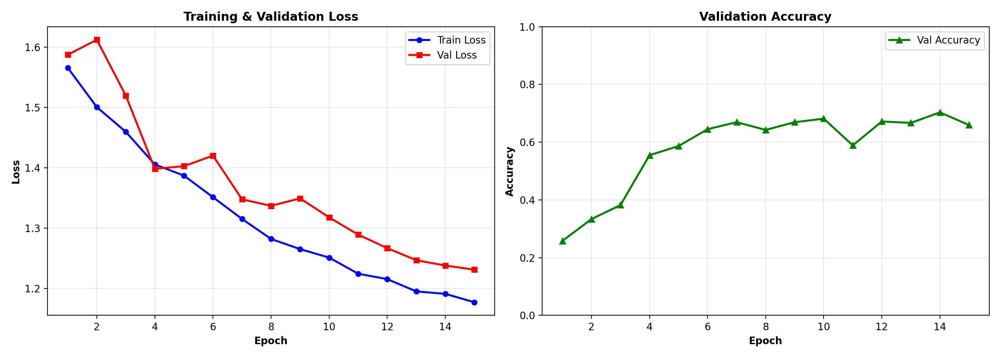

### Confusion Matrix
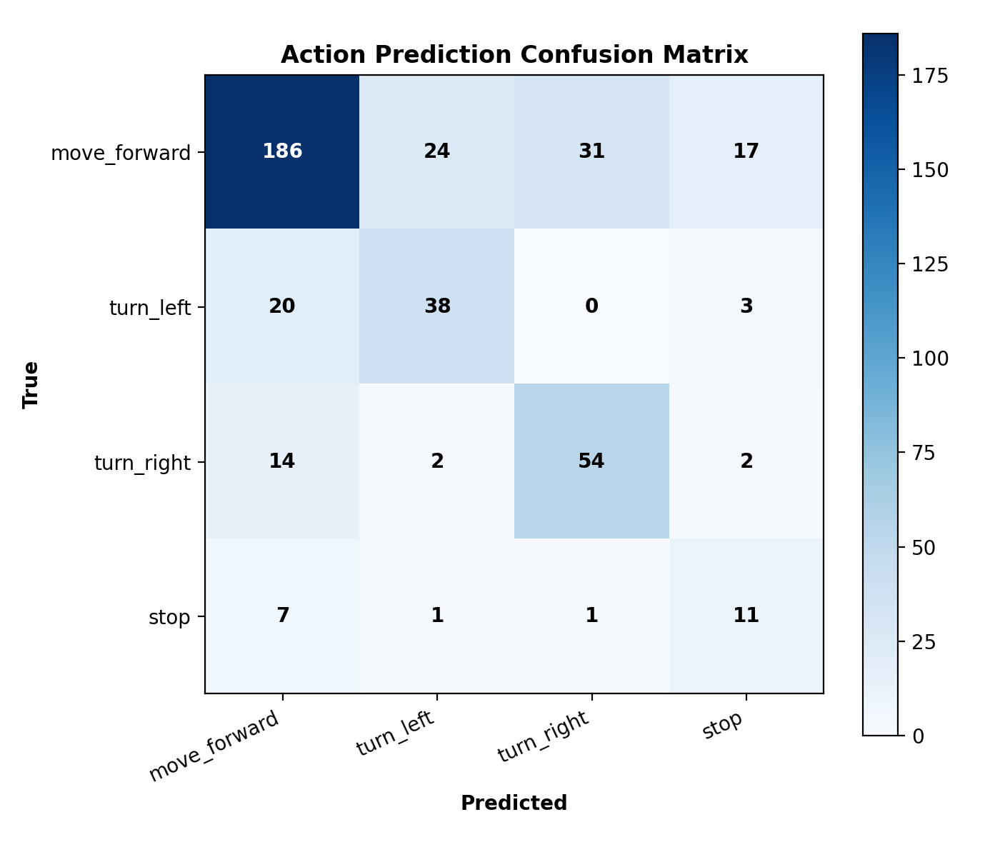

---
## Task 3: Baseline Training and Evaluation

- **Best Run:** lr_0p0002_bs_8
- **Best Validation Accuracy:** 0.6691
- **Success Rate (SR):** 5.0%
- **SPL:** 5.0%
- **Oracle Success Rate:** 60.0%
- **Navigation Error:** 1.68m
- **Eval Episodes:** 20

### Hyperparameter Sweep Results
| Run | LR | Batch Size | Best Val Acc | Final Val Acc | Final Val Loss |
|-----|-----|------------|-------------|---------------|----------------|
| lr_0p0002_bs_8 | 0.0002 | 8 | 0.6691 | 0.5912 | 1.3676 |
| lr_0p0001_bs_16 | 0.0001 | 16 | 0.6667 | 0.6229 | 1.2031 |
| lr_0p0001_bs_8 | 0.0001 | 8 | 0.6277 | 0.4428 | 1.3592 |
| lr_0p0002_bs_16 | 0.0002 | 16 | 0.6156 | 0.5547 | 1.2154 |

### Hyperparameter Comparison
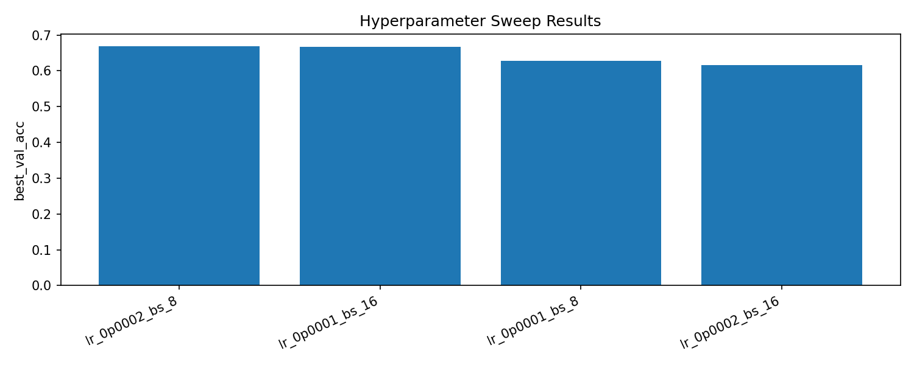

### SR/SPL Summary
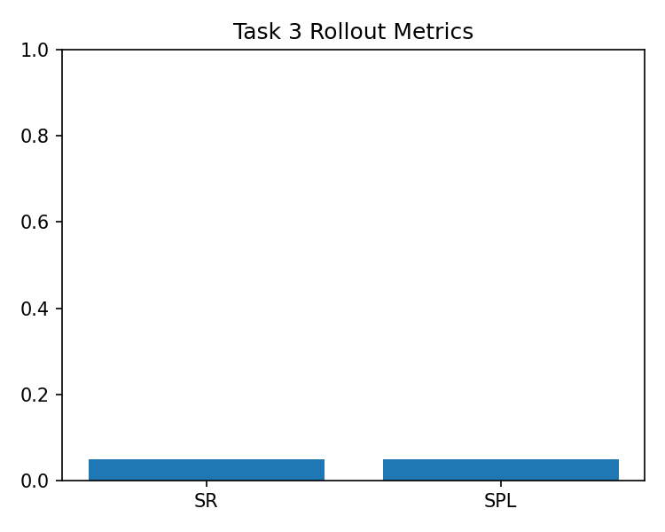

### Confusion Matrices
#### lr_0p0001_bs_16
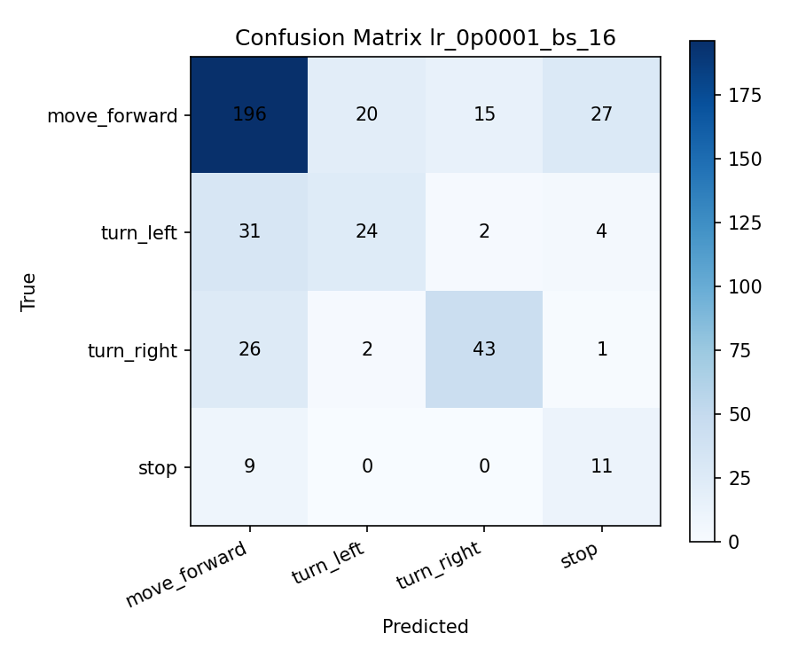

#### lr_0p0001_bs_8
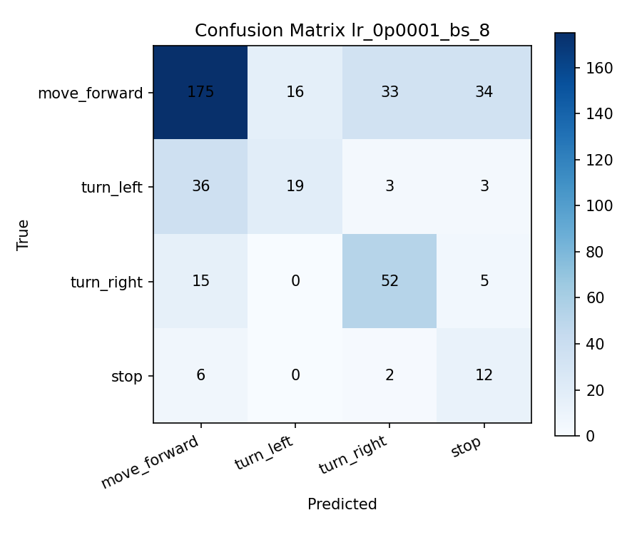

#### lr_0p0002_bs_16
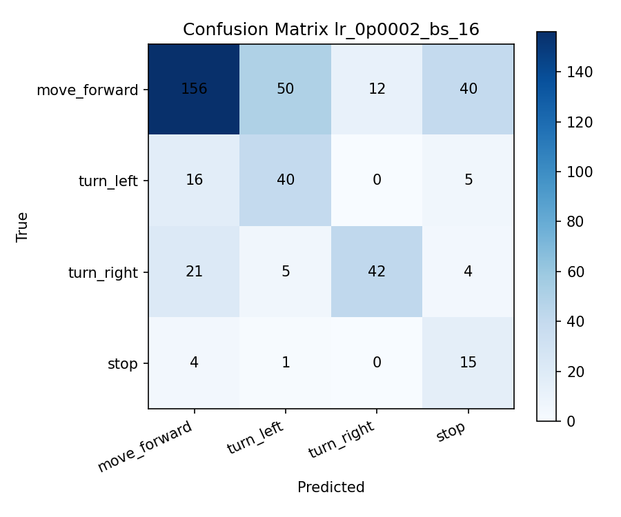

#### lr_0p0002_bs_8
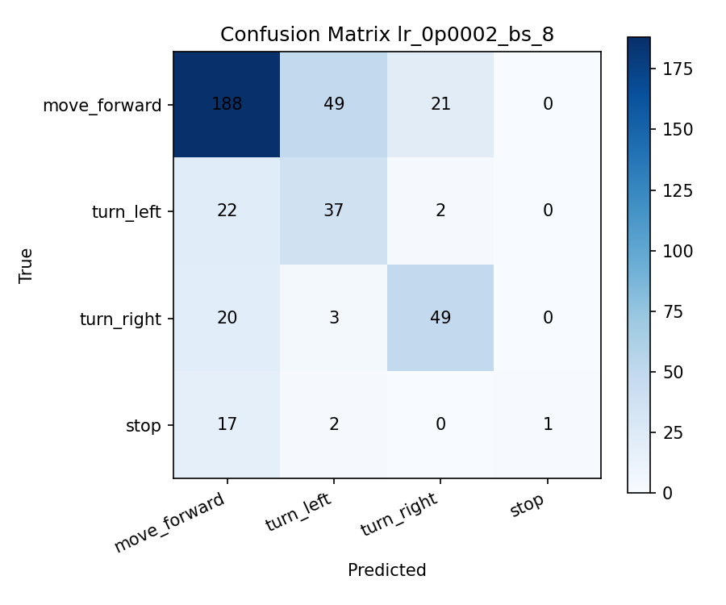

### Navigation Rollout Videos
Generated 10 rollout GIFs in `results/task3/videos/`

---
## Task 4: Generalization and Ablation Study

### Ablation Study Results
| Configuration | Trainable Params | Best Val Acc | Final Val Acc |
|---------------|-----------------|-------------|---------------|
| Fine-tune all (baseline) | 154,747,397 | 0.6277 | 0.6277 |
| Frozen vision encoder | 68,947,973 | 0.5888 | 0.5791 |
| Frozen text encoder | 91,581,445 | 0.1752 | 0.1752 |
| Frozen both encoders | 5,126,660 | 0.6253 | 0.6180 |

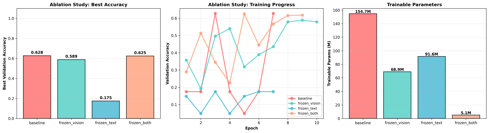

### Generalization Evaluation
| Scenario | Accuracy | Loss |
|----------|----------|------|
| Original validation set (same distribution as train) | 0.6691 | 1.0221 |
| Completely unseen environment | 0.6667 | 1.0380 |
| Same tasks, different instruction phrasing | 0.6124 | 1.0850 |

### Data Scaling Analysis
| Training Data % | Accuracy | Loss |
|----------------|----------|------|
| 10% | 0.6517 | 1.0306 |
| 25% | 0.6152 | 1.0259 |
| 50% | 0.6415 | 1.0090 |

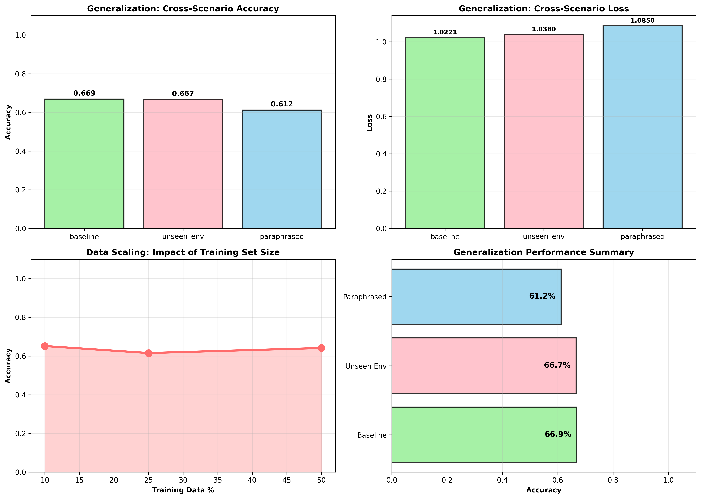

---
## Task 5: Controlled Extension

### Baseline vs Lightweight Variant
| Metric | Baseline | Lightweight | Change |
|--------|----------|-------------|--------|
| Fusion Dim | 512 | 256 | |
| Num Heads | 8 | 4 | |
| Dropout | 0.1 | 0.2 | |
| Trainable Params | 5,126,660 | 1,449,220 | +71.7% |
| Best Val Acc | 0.6813 | 0.6764 | -0.0049 |
| Mean Epoch Time | 20.4s | 19.3s | 1.06x |

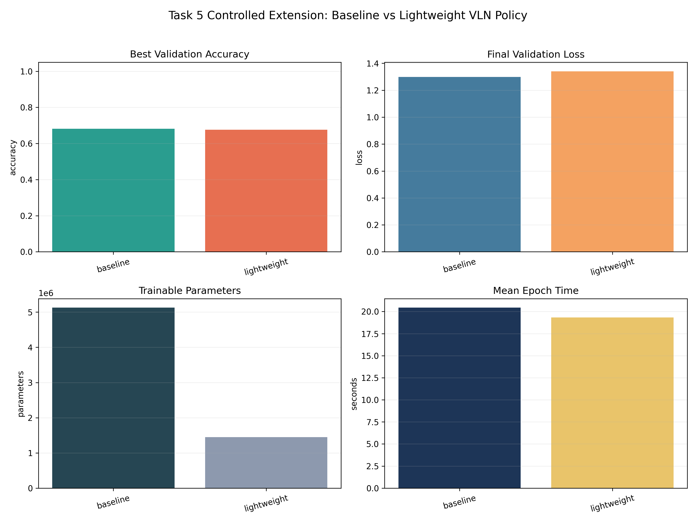

---
## Conclusion

This report presents a comprehensive evaluation of vision-language navigation 
using a CLIP-based cross-attention policy trained with imitation learning. 
Key findings:

1. **Navigation Performance:** Achieved SR=5.0%, SPL=5.0% on evaluation episodes
2. **Best Configuration:** lr_0p0002_bs_8 with accuracy=0.6691
3. **Ablation Finding:** baseline achieved best accuracy (0.6277)
4. **Extension Result:** Lightweight variant achieves 71.7% parameter reduction with comparable accuracy

